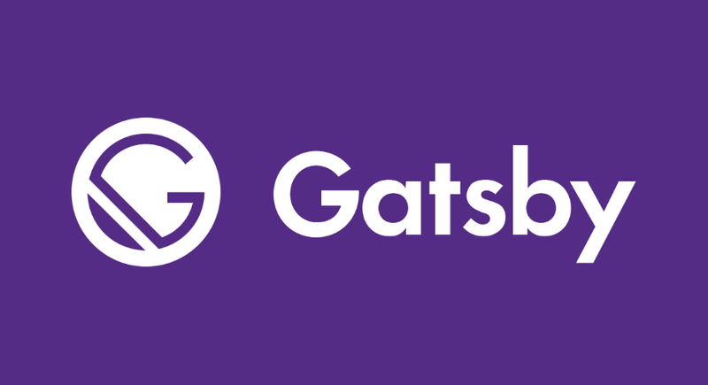

Learing the basics of Gatsbyjs

## Things I've Learned So far

1. Using links as a tags
2. Linking with graphql
3. How to config gatsby with plugins
4. How to setup gatsby to use graphql playground
